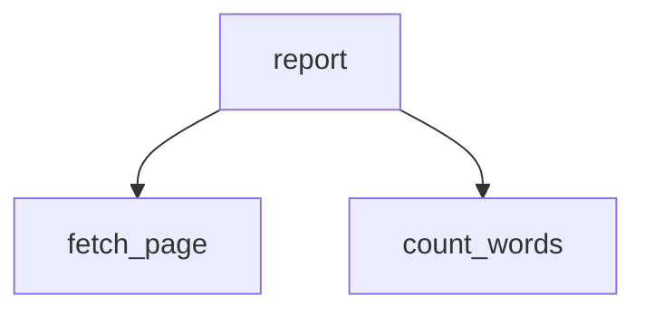

<div align="center">


</div>

## Overview

A small command-line tool that downloads a web page and counts the words on it.

## Features

| Feature | What it does |
|---|---|
| **Fetch page** | Download a web page and return its text. |
| **Count words** | Count how many words appear in the text. |
| **Report** | Print a word count for a URL. |

## How it works

Which functions call which:



<details open>
<summary><b>Getting started</b></summary>

```bash
git clone <your-repo-url>
cd word-counter
pip install requests
python main.py
```

</details>

<details>
<summary><b>Command-line options</b></summary>

| Option | Description |
|---|---|
| `--url` | Page to analyze |

</details>

<details>
<summary><b>Project structure</b></summary>

```
word-counter/
├── main.py
```

</details>

## License

MIT
